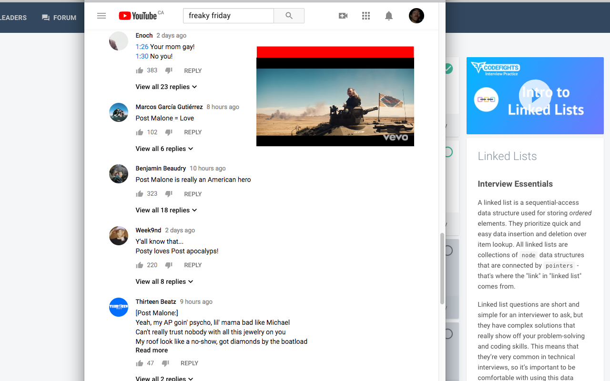
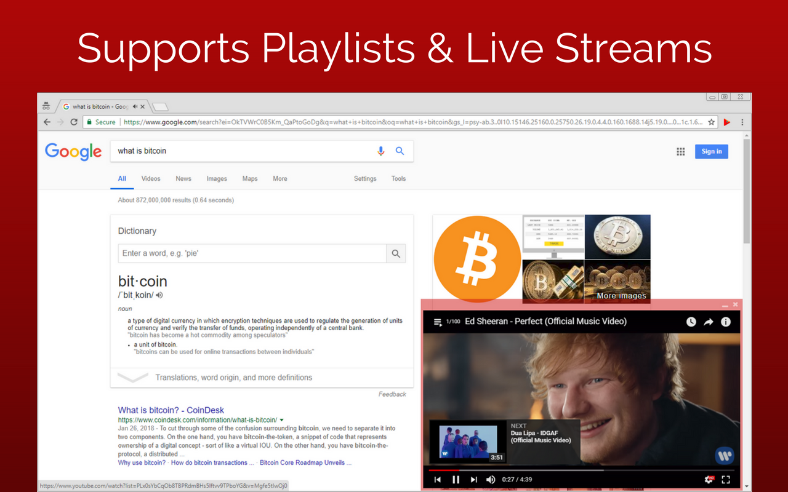
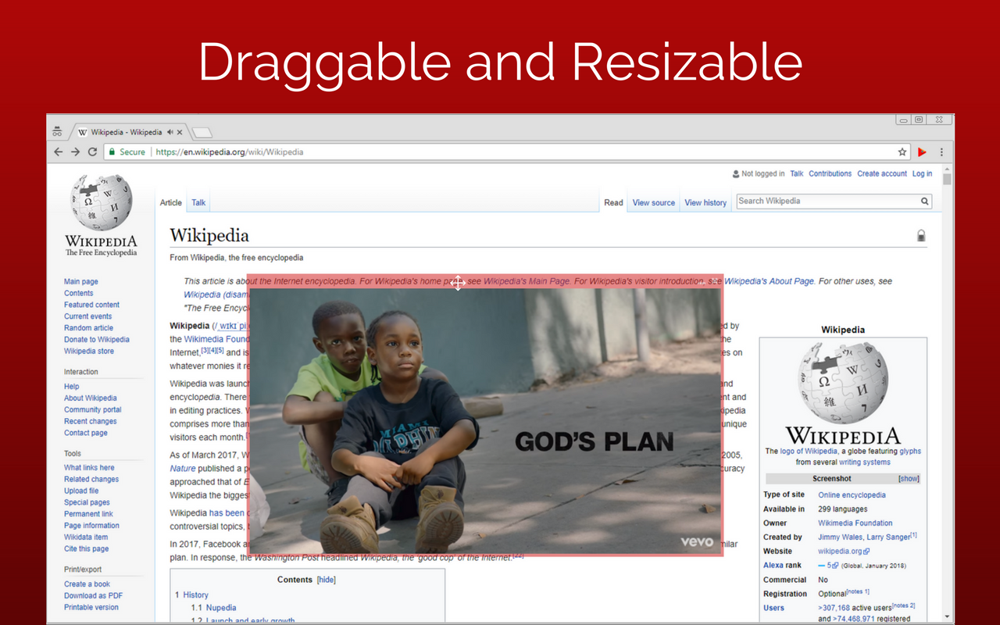
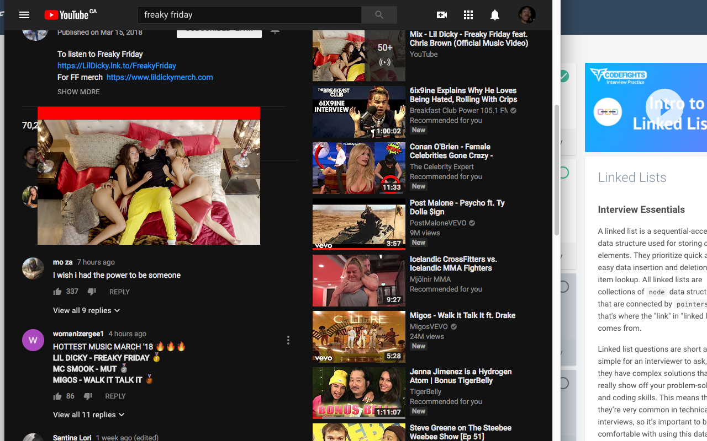

# VideoNail - Floating YouTube PiP Player
Watch YouTube videos while browsing the web or reading the comments! VideoNail is a Chrome extension that lets you watch YouTube videos on any website in a floating, always on top window. [Get it for free on the Chrome Web Store.](https://chrome.google.com/webstore/detail/videonail/nbpbjchgemnjhcpomnbjkkcfloafbema)

**Key Features:**
* Pins YouTube videos in a floating, always on top window that can be resized and re-positioned anywhere on the screen. The window can be minimized or closed at any time.
* Supports all video types including playlists and live streams
* Uses the native YouTube player with support for all video controls (volume, playback speed, video quality, etc.)
* Easily start on any site by right clicking a Youtube video or link
* Works with Adblock
* Autoplays video from where you left off
* No ads, completely free & open source, no 3rd-party apps required

**Screenshots:**

## Usage
If you'd like to simply use the extension, [get it for free on the Chrome Web Store.](https://chrome.google.com/webstore/detail/videonail/nbpbjchgemnjhcpomnbjkkcfloafbema).

If you'd like to contribute, work with the extension locally and make changes, clone/fork the repo and load the directory as an 'unpacked' extension in Chrome. If you aren't familiar with Chrome extensions, head over to the [Chrome developer site](https://developer.chrome.com/extensions/getstarted) to get started.

We have also included a bash script that packages all the core assets into a .zip file. To use it, your terminal must have the zip command installed (i.e. use a Unix OS).

## Contributing
Open issues for any problems you may find, and fix them if you can. Make sure your code is well commented. If you want to suggest features, open an issue and it will be reviewed shortly.

## License
VideoNail is licensed under the Apache 2.0 license - see [LICENSE.md](LICENSE.md) for details.

## Acknowledgements
VideoNail makes use of [Bootstrap 4](https://getbootstrap.com/), [Font Awesome](https://fontawesome.com/) for icons and the [YouTube IFrame Player API](https://developers.google.com/youtube/iframe_api_reference).
